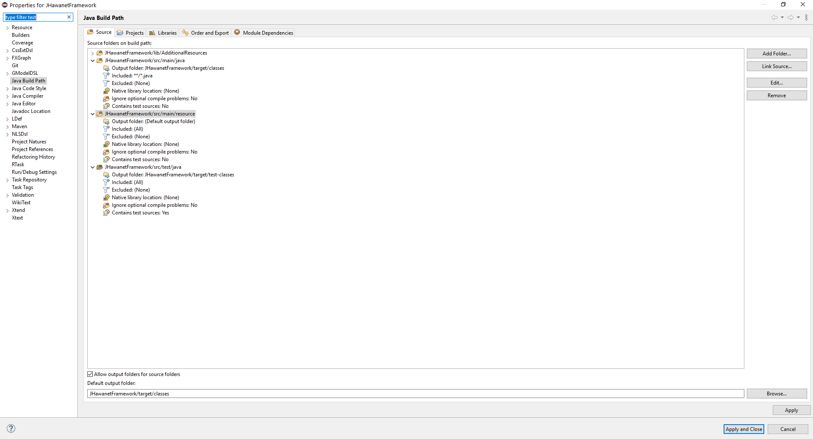
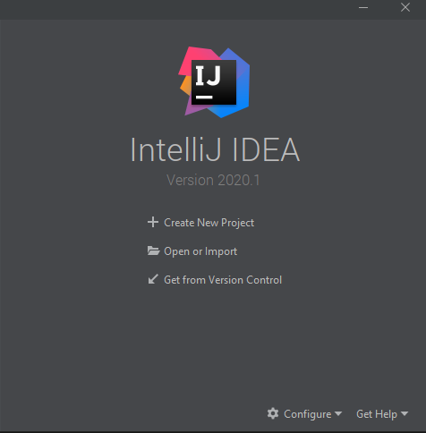
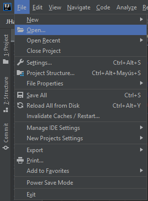
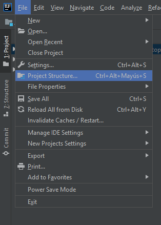
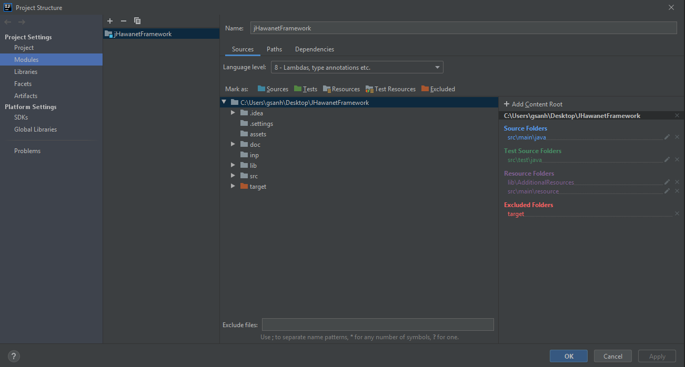
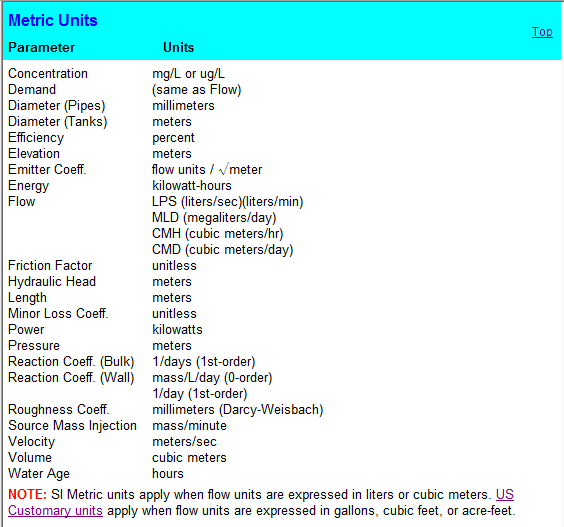
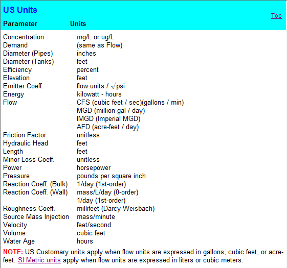

# JHawanetFramework

Este software permite la solución de problemas relacionados con redes de distribución de agua potable. Los problemas que el programa incluye por defecto son
+ El problema monoobjetivo de costo de inversion
+ El problema multiobjetivo de de regimen de bombeo, cuyos objetivos son el costo energetico y el costo de mantenimiento.

## Como instalar

Los pasos para instalar el software son los siguientes:

1. Instalar maven. Una guia de como instalarlo puede encontrarla [aquí](hhttps://maven.apache.org/index.html)
2. Una vez maven este instalado, hay que agregar el jar de la EpanetTolkit requerido para la simulación al repositorio de maven. Para esto ejecute el siguiente comando: 

```
mvn install:install-file -Dfile="lib/epajava.jar" -DgroupId=epajava -DartifactId=epajava -Dversion="1.0" -Dpackaging=jar
```
3. Ahora ejecute el comando:
```
mvn clean package
``` 
4. Despues de terminar la ejecución del comando el lanzador se encontrara en target/jfx/

5. Para volver a compilar solo hace falta ejecutar nuevamente el paso 3.

**NOTA**: Para poder ejecutar desde un IDE que permita proyectos maven se necesita haber realizado hasta el paso 2.

## Otras maneras de compilar
Compile with mvn jfx:jar to create a jar -> este comando realizara lo mismo que mvn package

Compile with mvn jfx:native to create a native -> genera un exe y si están instalados los programas correctos también generara un instalador.

## Abrir proyecto con eclipse
Abrir el proyecto desde eclipse y agregar la ruta lib/additionalResources y la carpeta src/resource, en caso de que no se encuentre, al *build path*. Para ello, seleccione la carpeta y muestre el menú contextual. Luego, en la opción *Build path* seleccione la opción *Use as source folder* (Puede cambiar la configuración también desde *Configure build path*). Esto se muestra en la imagen a continuación:


El *build path* debería mostrarse de la siguiente manera:



## Abrir Proyecto en IntelliJ
Abrir o exportar la carpeta del proyecto en IntelliJ. Para esto hay dos formas de hacerlo. La primera consiste en hacerlo desde la ventana de bienvenida usando la opción *Open or import*:



o desde un proyecto ya abierto ir a File > Open:



Una vez abierto el proyecto hay que revisar si las carpetas están correctamente configuradas. Para ello, es necesario agregar la carpeta lib/additionalResources y la carpeta src/resource en la configuración de la estructura del proyecto en caso de que no se encuentren ya agregadas. Para configurar la estructura del proyecto ve a File > Proyect Structure:



y en *Modules* revisa que este de la siguiente manera:



en caso de que no se encuentre la configuración de la manera indicada busca la carpeta deseada y seleccionala. Luego, has click sobre el botón *Resources*


con esto el proyecto estará listo para ser usado en IntelliJ. 

### Nota 1:
 Assets es solo una carpeta donde se suben las imágenes. No es usada por el proyecto.
### Nota 2:
 La version en ingles y la version en español de epanet a veces ocupan distintas palabras claves (Ej: Feet en ingles y Pies en español). Este programa lee el formato inp de la version en ingles.
### Nota 3:
 La ventaja de usar IntelliJ es que este posee un analizador de código que en mi opinión es bastante util y permite detectar el uso de algunas anotaciones extras para verificar el codigo como @NotNull y @Nullable. En caso de que el proyecto sea abierto usando eclipse estas anotaciones no tienen uso pero no causaran problemas en la compilación del proyecto.

### Nota 4:
Dependiendo de la unidad de flujo (*Flow*) escogida, el sistema de unidades cambia. Para más información ver en el manual de epanet la sección *Units of Measurement*. A continuación también se adjuntas unas imagenes referentes a esto:





### Nota 5:
Se debe tener cuidado con el *encoding* de los archivos. Por defecto, el programa lee ISO-8859-1. Pero para evitar cualquier error, mejor asegurar que los archivos de red no contengan caracteres raros como ´,ñ, etc.

### Nota 6: Para desarrolladores principalmente
Tener cuidado con cerrar epanet (epanet.ENclose). Si está cerrado hacer una llamada a la librería puede causar que el programa se cierre y no lanzara ninguna advertencia más que un código de error. 

